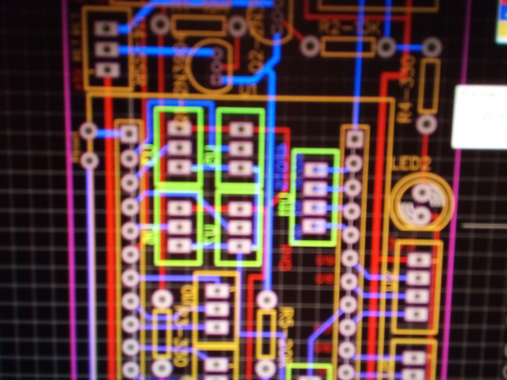
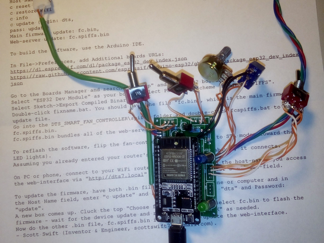
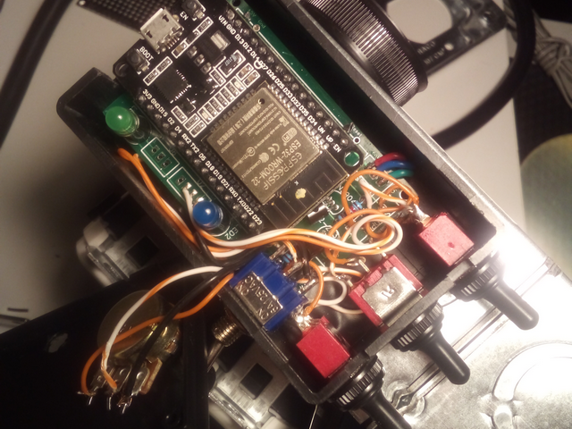

# esp32-fan-controller
Code for ESP32 fan-controller with custom printed circuit board using the Arduino IDE.

This code may be useful to paruse for ideas or or for adapting to your own ESP32 hardware project. Over-the-air WiFi firmware updates are supported.

It is for a custom PCB I ordered using EasyEDA upon which the ESP32 module is soldered and has switching transistors that drive solid-state relays. I should note that the PCB needs work. The ESP32 footprint is off by a bit so I had to bend the module's pins to fit the PCB holes for soldering.

The device is controlled via an ordinary web-browser over WiFi and can be remotely updated. There is a switch to switch between WiFi access-point mode and station mode (router connection). I use the AP mode to enter WiFi router credentials then flip the switch to connect to my router.

NOTE: This is built with the Old Arduino IDE (1.8.19) and ESP32 tools for Arduino 3.0.5  

NOTE: 6/18/2024 Updated for an ESP32S3 Dev Board when you set "#define ESP32_S3 true" in Fancontroller.h

Create a new folder in your Arduino IDE "projects" or "sketches" folder called FanControllerS3 and unzip these files into it.

In the same folder that has your "projects" or "sketches", create a "tools" folder and a "libraries" folder. Unzip the custom-modified "libraries" into the "libraries" folder. Unzip the files in "tools" into your "tools" folder.

Useful links:

https://www.arduino.cc/en/software (use the old 1.8.19 version or you won't be able to upload the SPIFFS data from the IDE!)

https://github.com/espressif/arduino-esp32

https://github.com/me-no-dev/ESPAsyncWebServer (note: this WILL NOT compile for the S3 board as-is - use my modified version in the "misc" folder!)

Contact: dxzl@live.com

